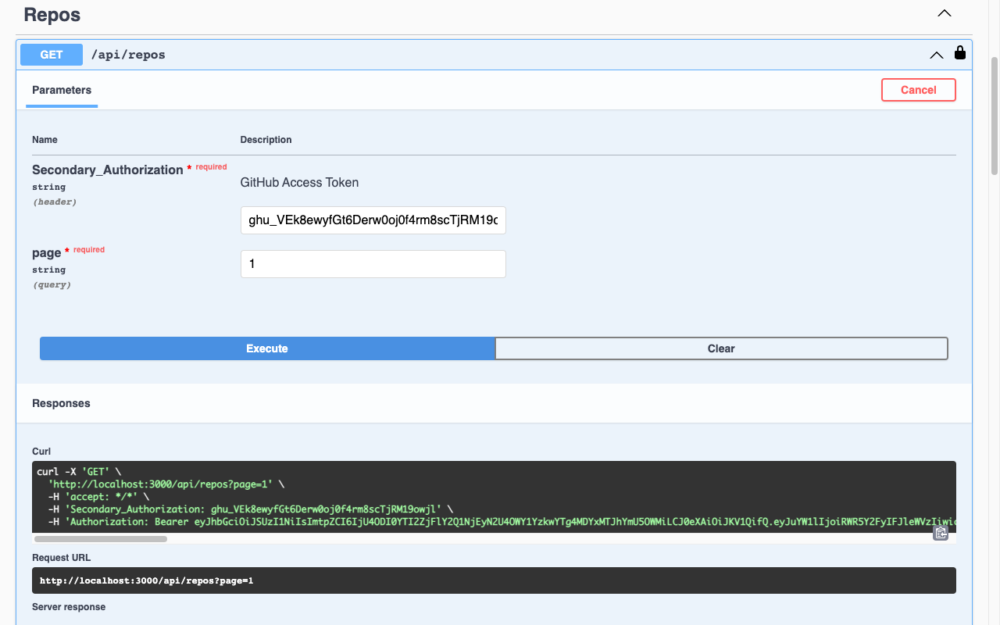

<p align="center">

</p>

# Quantum Git
**Built to track all commits of a git repository with your GitHub account.**

## Installation

**You're going to need yarn. You can install it by run `npm i -g yarn`. You must have installed node.js 18.12.1**. Then, you
can run the code:

```bash
$ yarn install
```

to install all the dependencies of the project

## Running the app

To run the app locally, first you need to have set up the environment variables. The unique environment
file that you need to serve the app without problems is the `.env` file. Then you can run the following code to start
the application:

```bash
# development
$ yarn start

# watch mode
$ yarn start:dev

# production mode
$ yarn start:prod
```

## Info

This project was thinking to be very scalable, so it's divided in modules. Each module has its own controllers,
services, and other stuffs that are related to it. I use swagger to document the API, so you can check the documentation
on the `/api` route once the app been started.

## Dependencies

* **@nestjs/passport** - A package that helps to integrate passport with nestjs.

* **@nestjs/swagger** - A package that helps to integrate swagger with nestjs and build the API's documentation.

* **dotenv** - A package that helps to manage the environment variables.

* **passport** - A package that helps to manage the authentication.

* **passport-jwt** - A package that helps to manage the authentication with jwt.

* **helmet** - A package that helps to secure the app.

* **firebase-admin** - A package that helps to manage the firebase from the server side.

* **octokit.js** - A library to manage the GitHub API, recommended by the GitHub's developers.

## Attachments



